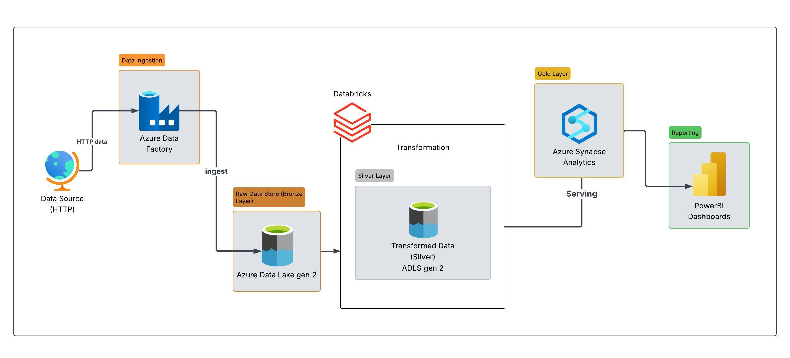

# Azure End-to-End-Data Pipeline Project
 A cloud-based data engineering + analytics workflow using ADLS Gen2, ADF, Databricks, Azure SQL, and Power BI.

## 🚀 Project Overview

This project demonstrates a complete end-to-end data pipeline built on **Microsoft Azure**, using **Azure Data Lake Storage Gen2 (ADLS Gen2)** as the main data layer and following a **Bronze → Silver → Gold architecture**.

Using **Azure Data Factory (ADF)** for orchestration and **Azure Databricks** for transformations, the data moves through multiple quality stages before being loaded into **Azure SQL Database**.  
Finally, **Power BI** is used to visualize insights from the curated Gold dataset.

This project was created as part of my Azure learning journey while preparing for **DP-900 (Azure Data Fundamentals)**.

---

## 🏗 Architecture

---

## 🔧 Technologies Used

- Azure Data Lake Storage Gen2 (ADLS Gen2)  
- Azure Data Factory (ADF)  
- Azure Databricks (PySpark)  
- Bronze/Silver/Gold architecture  
- Azure SQL Database  
- Power BI  

---

## 🔄 Pipeline Workflow

### **1️⃣ Bronze Layer — Raw Data**
- Raw files stored in ADLS Gen2  
- ADF triggers processing  
- Data kept unchanged for lineage  

### **2️⃣ Silver Layer — Cleaned Data**
- Data cleaning in Databricks  
- Null handling, type casting, filtering  
- Stored in ADLS Silver folder  

### **3️⃣ Gold Layer — Analytics-Ready**
- Business transformations  
- Aggregated tables  
- Stored in ADLS Gold folder  

### **4️⃣ Azure SQL Database**
- Gold tables loaded into SQL  
- Ready for analytics  

### **5️⃣ Power BI Dashboard**
- Direct connection to Azure SQL  
- KPIs and visuals created  

---

## 📸 Screenshots

Screenshots include:

- ADLS folder structure  
- ADF pipeline  
- Databricks notebook  
- SQL tables  
- Power BI report  

(Stored in `/screenshots`)

---

## 📁 Dataset Source

Dataset provided by **Ansh Lamba** as part of his Azure tutorial.  
Link: https://github.com//anshlambaoldgit/Adventure-Works-Data-Engineering-Project/tree/main/Data 

Dataset is **not re-uploaded** in this repository to respect ownership.

---

## 🎯 Key Learnings

- Working with ADLS Gen2  
- Bronze → Silver → Gold pipeline design  
- ADF orchestration  
- Databricks transformations  
- Azure SQL integration  
- Power BI connectivity  
- Cloud analytics workflow fundamentals  

---

## 🙌 Acknowledgment

Special thanks to **Ansh Lamba** for the tutorial guidance.

---

## 🤝 Connect With Me

LinkedIn: https://linkedin.com/in/srinathakoju 

